# 시니어든든 쇼핑 연습관 구현 격차 감사

- 감사일: 2026-07-18 (Asia/Seoul)
- production: <https://seniordeundun.com/shopping>
- 기준 문서: `시니어든든-쇼핑연습관-통합-제품-기술-설계서-실물이미지-보완본.md`
- 저장소 기준: `AGENTS.md`
- 감사 원칙: 파일 존재 여부가 아니라 production에서 사용자가 실제로 누르고 상태가 변하는지를 기준으로 판정
- 변경 범위: 이 보고서와 검증 스크린샷만 추가. 애플리케이션 코드는 수정하지 않음

## 1. 결론

현재 배포본은 **4개 미션의 화면과 최소 상호작용을 가진 프로토타입**이다. 처음 쇼핑 미션은 오답 확인, 수정, 재판정, 완료까지 가능하고 장마·비교·실수 찾기 미션도 각각 다른 분기 로직을 가진다. 따라서 정적 목업만 배포된 상태는 아니다.

다만 제품 설계서가 정의한 V1로 보기에는 핵심 격차가 크다.

1. 진행 단계만 localStorage에 기록하고 선택한 상품·옵션·수량·장바구니 상태를 복원하지 않아 새로고침 이어하기가 오작동한다.
2. 장마 미션은 네 상품을 전부 선택해도 29,800원이고 배송비가 모두 0원이므로 예산 초과 상태를 production에서 만들 수 없다.
3. 장바구니는 독립적인 `CartItem` 상태가 아니라 앞 단계 선택값을 읽어 보여주는 화면이다. 장바구니 안에서 추가·삭제·수량 변경을 할 수 없다.
4. 판정 함수는 순수 함수로 분리되어 있지만 범용 `ValidationRule` 엔진이 아니다. 정답 상품 ID, `2m`, `화이트`, 수량 1과 위험 ID가 코드에 하드코딩되어 있다.
5. 실수 찾기는 수량과 정기배송 두 항목만 구현되었다. 옵션·배송비 실수, 주문 취소·교환·반품·배송조회는 미구현이다.
6. 실물형 이미지는 실제 생성 자산이지만 V1 인벤토리보다 현저히 적고, 서로 달라야 하는 케이블 상품들이 같은 흰색 케이블 이미지를 재사용한다.
7. 제휴 링크는 production에서 실제 쿠팡파트너스 추적 링크로 생성되지만, 설계서가 정한 수동 링크 레지스트리가 아니라 쿠팡 검색 Open API를 사용한다. 허용 도메인 검사와 `noreferrer`, “새 창” 안내도 없다.

## 2. production과 배포 커밋

| 확인 항목 | 결과 |
|---|---|
| 로컬 HEAD | `cafe23661339512567a9bb748b000acc54fa737b` |
| 원격 `master` | `cafe23661339512567a9bb748b000acc54fa737b` |
| GitHub commit status | `Vercel: success`, `Deployment has completed` |
| GitHub deployment environment | `Production` |
| Vercel 배포 기록 | `EWcC25ZjChha1NfRSmGd7ciD4bta` |
| production 고유 기능 확인 | `/shopping`과 16개 구체 라우트 모두 HTTP 200, 신규 쇼핑 콘텐츠 노출 |
| 판정 | production에는 `cafe23661339512567a9bb748b000acc54fa737b`가 반영됨 |

## 3. 요청한 12개 핵심 답변

| 질문 | 답변 |
|---|---|
| 1. 현재 사용 가능한 미션 수 | **4개**: 처음 쇼핑, 장마 예산, 상품 비교, 주문 실수 찾기 |
| 2. 실제로 서로 다른 로직을 가진 미션 수 | **4개**. `guided`, `budget`, `compare`, `mistake`가 각각 별도 렌더 분기와 평가 함수를 사용한다. 단, 범용 규칙 엔진은 아니다. |
| 3. 정적 카드만 있는 미션 수 | **0개**. 공개된 네 미션 모두 클릭·선택·완료 흐름이 있다. 주문 해결 안내는 정적 문구지만 미션으로 등록되어 있지 않다. |
| 4. 장바구니 상태가 실제로 작동하는지 | **부분적으로만 작동**. 선택 상품·옵션·수량을 reducer가 기억해 장바구니 화면에 반영하지만 독립 장바구니 상태, 담기 동작, 장바구니 내 삭제·수량 변경은 없다. |
| 5. 배송비가 총액에 포함되는지 | 코드 계산에는 포함된다. 비교 미션의 1m 케이블은 5,500원+배송비 2,500원=8,000원으로 표시됐다. 그러나 처음 쇼핑 수량 2개에서는 배송비도 두 번 곱해 16,000원이 되며, 장마 상품 배송비는 모두 0원이다. |
| 6. 예산 초과 후 사용자가 수정할 수 있는지 | **불가능**. 현재 장마 상품 전체 합계가 29,800원이라 30,000원을 넘길 수 없다. 선택 화면에서 상품 토글 제거는 작동하지만 “초과 후 수정” 흐름은 도달 불가다. |
| 7. 성공 판정이 하드코딩인지 규칙 엔진인지 | evaluator 순수 함수는 있으나 **하드코딩 판정**에 가깝다. `correctProductId` 외 옵션 문자열과 수량, 피드백, 모드별 로직이 함수에 직접 작성되어 있다. |
| 8. localStorage 이어하기가 실제로 작동하는지 | **오작동**. 완료 횟수와 마지막 결과는 유지되지만 진행 중 새로고침 시 5/6 단계에서 1/6 단계로 초기화됐다. 선택 상태도 저장하지 않는다. |
| 9. 실물형 이미지가 실제 생성 자산인지 임시 이미지인지 | **실제 생성 정적 자산**이다. 원본 PNG 6개와 프롬프트가 있다. 다만 배포본은 JPG이고, 케이블 변형 이미지·상태 이미지 등 V1 인벤토리가 누락되었다. |
| 10. 쿠팡파트너스 링크가 실제 제공 링크인지 | production에는 `https://link.coupang.com/re/AFFSDP?...lptag=AF3698234...` 형식의 실제 추적 링크가 노출된다. 저장소에 사용자가 수동 제공한 링크가 아니라 서버의 쿠팡 검색 API 결과다. |
| 11. 메인 사이트에서 쇼핑 기능에 진입할 수 있는지 | **가능**. 메인에 “쇼핑 연습관 들어가기”, `/kiosk` 하단에 “쇼핑 연습관 보기”가 실제 노출된다. 다만 연습마을의 동등한 장소 카드나 모바일 하단 탭으로 편입되지는 않았다. |
| 12. production 배포 커밋 | **`cafe23661339512567a9bb748b000acc54fa737b`** |

## 4. 기능별 구현 격차 표

| 기능명 | 설계서 요구사항 | 현재 구현 파일 | 실제 브라우저 작동 여부 | 상태 | 부족한 부분 | 원인 | 수정 대상 파일 | 필요한 테스트 | 우선순위 |
|---|---|---|---|---|---|---|---|---|---|
| 메인 진입 | 디지털 생활 연습마을에 “든든쇼핑” 장소 카드 추가 | `app/page.tsx`, `components/home/ShoppingPracticeBanner.tsx` | 메인 배너 CTA로 `/shopping` 진입 가능 | 부분 구현 | 동등한 장소 카드, 오늘의 연습·주간 도전 연결 없음 | 기존 홈 하단에 별도 배너만 삽입 | `components/home/PracticeGrid.tsx`, 홈 미션 데이터 | 메인에서 쇼핑 카드 클릭, 오늘 미션 연결 | P0 |
| 연습 목록 진입 | 기존 연습 목록에 쇼핑 장소·설명·시작 버튼 | `app/kiosk/page.tsx` | `/kiosk` 하단 별도 배너로 진입 가능 | 부분 구현 | 7종 연습 카드와 같은 목록 항목이 아니며 “준비 중” 아래에 배치 | `PRACTICES` 데이터에 등록하지 않고 페이지 하단에 추가 | `lib/practices.ts`, `app/kiosk/page.tsx` | 연습 카드 수·링크·모바일 위치 | P0 |
| 쇼핑 홈 | 추천, 처음 배우기, 예산, 비교·실수, 주문 해결, 기록 | `app/shopping/page.tsx`, `ShoppingHubProgress.tsx` | 4개 미션과 완료 수 표시 | 부분 구현 | 추천 미션, 세부 연습 메뉴, 주문 해결, 도장, 실제 상품 안내 부족 | 4개 미션 카드와 안전 문구만 구현 | `app/shopping/page.tsx`, `content/shopping.ts` | 섹션 노출·featured·기록·이어하기 | P0 |
| 미션 안내·시작 | 시간, 난이도, 실제 결제 없음, 48px 시작 버튼 | `app/shopping/missions/[missionSlug]/page.tsx` | 네 미션 안내와 시작 링크 작동 | 완료 | 큰 격차 없음 | 공통 정적 소개 페이지 구현 | 동일 파일 | 네 slug의 안내·시작 E2E | P0 |
| 검색어 입력·선택 | 지정 검색어 입력 또는 추천어 선택, 성공 조건 검증 | `ShoppingPracticeRunner.tsx` | 입력값과 추천 버튼은 변함 | 부분 구현 | 검색어가 결과를 필터링하거나 검증하지 않음. 빈 값·임의 값이어도 동일 결과, “다음”으로 검색 생략 가능 | `searchTerm`은 표시 상태일 뿐 evaluator 입력이 아님 | `ShoppingPracticeRunner.tsx`, `evaluator.ts`, 미션 데이터 | 빈 검색·오검색·추천 검색·결과 필터 | P0 |
| 검색 결과 | 상품명·예시 가격·배송비·광고 표시 확인 | `PracticeProductCard.tsx`, `content/shopping.ts` | 3개 카드 선택, 가격·배송비·광고 표시 작동 | 부분 구현 | 검색어와 무관하고 케이블 3종이 같은 사진 사용 | 고정 `productIds` 목록과 단일 이미지 재사용 | `content/shopping.ts`, 이미지 자산 | 검색 조건별 결과, 광고 카드 구분, 이미지 구분 | P0/P3 |
| 상품 상세 | 규격·구성·리뷰 위치 확인, 필수 정보 2개 이상 확인 | `ShoppingPracticeRunner.tsx` | 선택 상품의 단자·길이·색상·구성 표시 | 부분 구현 | 사용자가 정보를 확인했다는 상호작용·검증 없음, 리뷰 위치 없음 | 상세가 읽기 전용 표이고 다음 버튼이 무조건 활성 | `ShoppingPracticeRunner.tsx`, 미션 데이터 | 정보 확인 체크 전/후 진행 가능 여부 | P0 |
| 옵션·수량 | 상품별 옵션 데이터, 필수 옵션·요구 수량 판정 | `ShoppingPracticeRunner.tsx`, `evaluator.ts` | 길이·색상·수량 변경 및 판정 작동 | 부분 구현 | 상품 옵션과 무관하게 모든 상품에 1m/2m/3m·화이트/블랙 제공, 옵션 추가금·disabled 없음 | `ProductOptionGroup` 모델 없이 JSX에 옵션 하드코딩 | `schemas.ts`, `content/shopping.ts`, runner, evaluator | 상품별 옵션, 미선택, 추가금, 수량 경계 | P1 |
| 장바구니 담기 | `CartItem`, 담기, 옵션·수량 재확인, 수정·삭제 | `ShoppingPracticeRunner.tsx` | 선택값이 장바구니 화면에 표시됨 | 부분 구현 | 명시적 담기 버튼·CartItem 없음, 장바구니에서 수정·삭제 불가 | `selectedProductId`/배열을 장바구니처럼 투영 | `schemas.ts`, runner 또는 cart reducer/selectors | 담기·중복·삭제·수량변경·옵션 유지 | P1 |
| 가격·배송비 합산 | `(가격+옵션 추가금)×수량 + 배송 정책` | `lib/shopping/evaluator.ts`, runner | 비교에서 5,500+2,500=8,000 표시 | 부분 구현 | guided는 `(가격+배송비)×수량`으로 배송비도 수량만큼 곱함, 옵션 추가금 없음 | 총액 selector가 없고 화면별 계산식 중복 | evaluator/selectors, runner | 유료배송 수량 1·2, 무료배송, 옵션 추가금 | P1 |
| 주문 전 확인 | 상품·옵션·수량·상품가·배송비·총액 체크 | `ShoppingPracticeRunner.tsx` | 상품·옵션·수량·배송비 표시 | 부분 구현 | 상품가와 최종 총액이 주문 전 확인 화면에 없음, 확인 체크 동작 없음 | 정적 `ReviewChecklist` 문자열만 렌더 | runner, 공통 `OrderReview` | 총액 표시, 확인 항목 체크, 미확인 차단 | P0/P1 |
| 오답 이유 표시 | 실패 대신 구체적 설명 후 재시도 | `evaluator.ts`, runner | 잘못된 상품·길이·색상·수량 이유 4개 표시 | 부분 구현 | C타입 1m 상품에도 “단자를 다시 확인”이라고 잘못 설명 | exact product ID 실패를 단자 실패 문구로 매핑 | evaluator, 규칙 데이터 | 규칙별 정확한 피드백, 복수 오류 | P0/P1 |
| 수정·재판정 | 이전으로 돌아가 수정 후 같은 규칙으로 재평가 | runner/evaluator | 1m·블랙·2개 오답 후 상품·옵션·수량을 고쳐 완료 가능 | 완료 | 장바구니 안 직접 수정은 안 됨 | 내부 이전 버튼과 reducer 상태 유지 | runner | 오답→이전→수정→100점 E2E | P0 |
| 완료·기록 | 결과, 완료 처리, 도장, 배운 점, 상세 결과 | `ShoppingResult.tsx`, `progress.ts` | 100점 결과와 완료 미션 수가 새로고침 후 유지 | 부분 구현 | 도장 없음, guided 확인 규격과 budget 사용액·남은 금액 결과에 없음 | `completed` count와 `lastResult`만 저장, 결과 UI가 공통 학습 문구만 표시 | result, progress schema | 완료 횟수·결과 상세·도장·재도전 | P0/P1 |
| 새로고침 이어하기 | 단계와 전체 active state 저장 후 복구 여부 확인 | `progress.ts`, runner, hub progress | 5/6 장바구니에서 새로고침하자 1/6 검색으로 초기화 | 오작동 | 상품·옵션·수량·장바구니 미저장, 저장된 step도 reducer 초기값에 반영 안 됨 | `saveShoppingStep`은 step만 기록하고 runner는 읽지 않음. 마운트 후 step 0으로 덮어씀 | progress adapter, runner 초기화/복구 UI | 단계별 새로고침, 손상 JSON, migration, 이어하기 거절 | P0 |
| 장마 예산 선택 | 필수 3종과 선택 품목, 예산 미터, 여러 상품 선택 | budget 분기, `evaluateBudgetMission` | 우산·제습제·테이프 선택과 23,300원 계산 작동 | 부분 구현 | 수량·대체상품·배송비 비교 없음, 상품 4개뿐 | 제품 풀이 최소 고정 목록 | content, runner, schemas | 여러 카테고리·수량·대체상품 | P1/P2 |
| 예산 초과·제거 | 배송비 포함 초과 안내 후 상품 제거·재판정 | budget 분기 | 네 상품 전부 선택해도 29,800원, 남은 200원 | 미구현 | production에서 초과 상태 도달 불가. 카트 안 제거도 없음 | 모든 장마 배송비 0원, 전체 가격이 예산보다 낮음 | content 상품/미션, cart UI, evaluator | 30,001원·정확히 30,000원·초과 후 제거 E2E | P1 |
| 필수 품목 누락 | 카테고리 누락을 구체적으로 판정 | `evaluateBudgetMission` | 우산만 담으면 “필수 준비물이 더 있어요” 표시 | 완료 | 어떤 카테고리가 각각 빠졌는지는 한 문장으로만 안내 | 누락 ID별 문구가 아닌 공통 피드백 | evaluator/feedback data | 3개 카테고리 각각 누락 | P1 |
| 상품 비교 | 총비용·규격·길이·구성·배송 조건 기반 선택 | compare 분기/evaluator | 3개 비교, 오답 3개 묶음에 피드백 표시 | 부분 구현 | `correctProductId` exact match이며 조건 규칙을 계산하지 않음, 정기배송·반품·도착일 없음 | 범용 attribute rule 부재 | schemas, mission data, evaluator, compare UI | 동일 조건의 새 상품, 배송비, 묶음, rule mutation | P1/P2 |
| 실수 찾기 | 수량·옵션·정기배송·배송비 등 클릭 위험 지점 | mistake 분기/evaluator | 수량·정기배송 체크박스 선택·완료 작동 | 부분 구현 | 옵션·배송비 위험 지점 없음. 상품 이름은 오답 decoy뿐 | `requiredMistakeIds`가 두 개이고 고정 화면 | content, runner/MistakeFinder, evaluator | 수량·옵션·정기배송·배송비 각각 및 오답 힌트 | P2 |
| 주문 해결 | 배송조회·취소·교환·반품·사기문자 미션 | 없음; 홈 안전 문구와 mistake 마지막 설명만 존재 | 클릭 가능한 주문 해결 미션 없음 | 미구현 | 전체 order-help 모드 미구현 | V1.5/후속 기능을 정적 문장으로 대체 | mission data, order-help UI, evaluator | 취소·반품·배송조회·사기문자 E2E | P2 |
| 완료 후 실제 상품 | 완료 뒤 고지→품목별 실제 상품 링크 | result, product collection, AffiliateCard | result에서 collection 이동, 장마 3개 실제 링크 노출 | 부분 구현 | 결과 화면 자체에는 상품별 링크가 없고 한 단계 더 이동. 새 창 문구·아이콘 없음 | 공통 collection CTA와 기존 AffiliateCard 재사용 | result, collection, AffiliateCard | 완료 전 미노출, 완료 후 링크, 새 창 안내 | P3 |
| 연습/제휴 영역 분리 | 연습 중 외부 링크 금지, 완료 후 시각·문구 분리 | runner, result, AffiliateCard | 연습 화면 외부 링크 0개, 결과 경계와 광고 고지 확인 | 완료 | 큰 격차 없음 | AGENTS의 분리 원칙 반영 | 동일 파일 | practice sponsored 링크 0, 결과 후 노출 | P3 |
| 제휴 URL·보안 | 수동 공식 링크, https/허용 도메인, `sponsored noopener noreferrer` | `lib/coupang.ts`, product collection, AffiliateCard | 실제 `link.coupang.com/re/AFFSDP`와 `_blank` 작동 속성 확인 | 부분 구현 | 수동 제공 링크가 아닌 검색 API, 도메인 allowlist 없음, `noreferrer` 없음, API 실패/상품 품질 운영 의존 | 기존 Coupang API 클라이언트를 collection에서 직접 호출 | affiliate registry, URL validator, AffiliateCard | 허용/비허용 URL, 빈 링크, rel, API 실패 | P3 |
| 모바일 360px | 360×800에서 겹침·가로 넘침 없음, 고정 조작부 | shopping CSS, runner | 허브·카트·장마·제휴 화면 `scrollWidth=360`, 하단 버튼 작동 | 완료 | 검색 결과 즉시 캡처에서 지연 로딩 이미지가 늦게 보인 사례는 있었으나 레이아웃 이동은 확인되지 않음 | 반응형 CSS와 next/image 사용 | CSS/Image QA | 360/390/768/1440 캡처, 이미지 로드 후 CLS | P4 |
| 큰 글씨 | 1.15~1.25배, 상태 저장, 모바일 미파손 | `BigTextToggle.tsx`, `globals.css` | `data-bigtext=1`, `body zoom:1.15`; 360px 가로 넘침 없음 | 완료 | 연습 화면 자체에는 토글이 없어서 미리 설정해야 함 | 집중형 practice에서 Header 제거 | practice header/accessibility | 토글 전후 시각 크기, 새로고침, practice overflow | P4 |
| 이미지 시스템 | V1 인벤토리, WebP, 고유 상품 이미지, 검수 상태 | `public/images/shopping`, `design-assets`, asset plan | 생성 자산이 실제 production에 표시 | 부분 구현 | 6개 원본뿐, hero와 rainy 이미지 중복, 케이블 4종이 한 이미지 공유, state 자산 없음, JPG, 승인/검수 로그 없음 | 최소 자산만 생성하고 문서에서 전체를 “완료”로 표시 | assets, content, asset plan, AGENTS | 파일 인벤토리·해시·alt·용량·4뷰포트 시각 회귀 | P3/P4 |
| 미션/상품 스키마 | JSON 기반 Mission/Product/Option/Rule 모델과 Zod | `schemas.ts`, `content/shopping.ts` | 빌드 시 Zod parse 통과 | 부분 구현 | TS 배열이며 version/status/rules/scoring/options/delivery 등 핵심 필드 없음 | 축약 스키마로 빠르게 구성 | schemas, data JSON, loaders | schema fixture, 미지원 rule 빌드 실패 | P1 |
| 범용 판정 엔진 | JSON rules를 순수 evaluator가 공통 처리 | `evaluator.ts` | 네 모드별 순수 함수는 작동 | 부분 구현 | 모드별 if/정답 문자열·피드백 하드코딩, `satisfiedRuleIds`도 성공 시 `all` 하나 | ValidationRule interpreter와 selector 부재 | engine/evaluator/scoring/selectors | 규칙별 단위 테스트, 새 미션 무코드 추가 | P1 |
| localStorage 관리 | version/migration/복구/초기화/active state/도장/preferences | `progress.ts`, BigText 별도 키 | 파싱 오류 기본값·완료 count는 작동 | 부분 구현 | 키 이름 설계 불일치, migration·기록 초기화·도장·preferences 통합·active state 없음 | 최소 progress object만 구현 | storage adapter, records UI | 손상·구버전·초기화·용량·개인정보 없음 | P1/P4 |
| 분석 이벤트 | 허브→상품→장바구니→예산→제휴 전 과정 익명 이벤트 | runner, `AffiliateCard.tsx`, `lib/track.ts` | 시작·힌트·실패·완료·affiliate click 일부 존재 | 부분 구현 | hub/card/view/add/budget exceeded/collection viewed/cancelled 누락, 이벤트 명세 불일치 | 필수 흐름만 수동 track 호출 | analytics adapter, 각 UI | 이벤트 이름·PII 제외·중복 발생 | P4 |
| 자동 테스트·접근성 | unit/component/E2E/axe/키보드/360/이어하기/외부링크 | `tests/shopping.spec.ts` | 기존 전체 32개 테스트 통과 | 부분 구현 | 쇼핑 테스트 3개뿐. 예산 초과·제거, 이어하기, 비교, 실수, 제휴 새 창, 키보드, axe, unit 테스트 없음 | happy path 위주 E2E만 작성 | tests/shopping 및 unit/component setup | 설계서 21장 전체 테스트 | P4 |
| 기존 키오스크 회귀 | 기존 7종과 핵심 시나리오 무회귀 | 기존 Playwright suites | 2026-07-18 전체 32개 통과, 키오스크 시나리오 포함 | 완료 | 현재 자동화 범위 밖 수동 기기 차이는 별도 | 기존 회귀 테스트 유지 | tests/kiosk-cafe 등 | 기존 전체 suite를 CI 필수로 유지 | P4 |

## 5. 지정한 25개 사용자 흐름 실행 결과

| 번호 | 실행 결과 | 판정 근거 |
|---:|---|---|
| 1 | 성공 | `/shopping` HTTP 200, 허브 실제 표시 |
| 2 | 성공 | 소개 화면의 “연습 시작하기”로 practice 진입 |
| 3 | 부분 | 검색어 입력·추천 선택은 되지만 검색 로직에는 사용되지 않음 |
| 4 | 성공 | 3개 결과 카드 중 상품 선택 상태 변경 |
| 5 | 부분 | 상세정보는 보이나 확인 행동은 검증하지 않음 |
| 6 | 성공 | 1m/2m/3m, 화이트/블랙, 수량 1~9 조작 |
| 7 | 부분 | 다음 단계로 장바구니 화면 이동만 하며 명시적 담기 상태 없음 |
| 8 | 부분 | 유료배송 합산 표시. 수량 2개에서 배송비도 2번 계산되는 문제 |
| 9 | 부분 | 주문 전 상품·옵션·수량·배송비는 보이나 상품가·총액 누락 |
| 10 | 성공 | 잘못된 상품·길이·색상·수량 이유 표시 |
| 11 | 성공 | 이전으로 돌아가 상품·옵션·수량 수정 후 100점 완료 |
| 12 | 성공 | 완료 수와 마지막 결과 새로고침 후 유지 |
| 13 | 실패 | 장바구니 5/6에서 새로고침 후 검색 1/6으로 초기화 |
| 14 | 성공 | 장마 미션 시작 가능 |
| 15 | 성공 | 우산·제습제·미끄럼방지 선택과 총 23,300원 표시 |
| 16 | 실패 | 모든 상품 배송비 0원, 전체 29,800원이라 초과 불가능 |
| 17 | 실패 | 초과 상태가 없어 “초과 후 제거” 검증 불가. 일반 상품 토글 제거는 작동 |
| 18 | 성공 | 우산만 선택 시 필수 품목 누락 경고 |
| 19 | 부분 | 비교 선택·오답 피드백은 되나 exact product ID 하드코딩 |
| 20 | 부분 | 수량·정기배송만 찾을 수 있음. 옵션·배송비 실수는 없음 |
| 21 | 성공 | 완료 결과의 별도 CTA를 통해 실제 상품 collection 표시 |
| 22 | 성공 | practice에 sponsored 링크 0개, collection에 광고·고지·실제 이미지 분리 |
| 23 | 성공 | 표본 주요 화면 360px에서 가로 overflow 0 |
| 24 | 성공 | 큰 글씨 `zoom:1.15`, 저장·360px 미파손. practice 내 토글은 없음 |
| 25 | 성공 | 전체 Playwright 32/32 통과, 기존 7종 키오스크 핵심 흐름 포함 |

## 6. 스크린샷 증거

모든 스크린샷은 2026-07-18 production을 360×800 Chromium에서 캡처했다.

### 쇼핑 홈과 진입

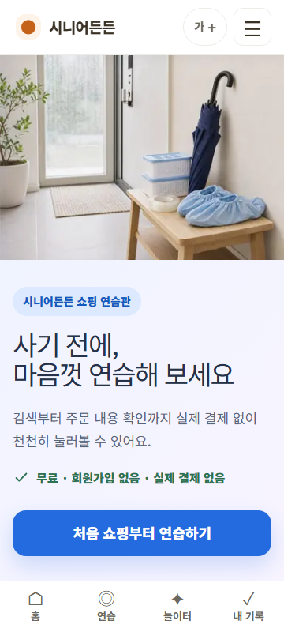

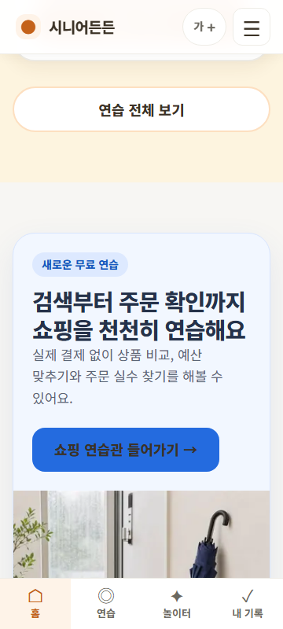

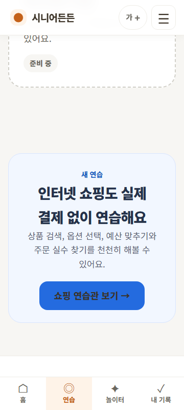

### 처음 쇼핑하기

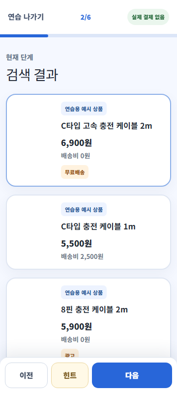

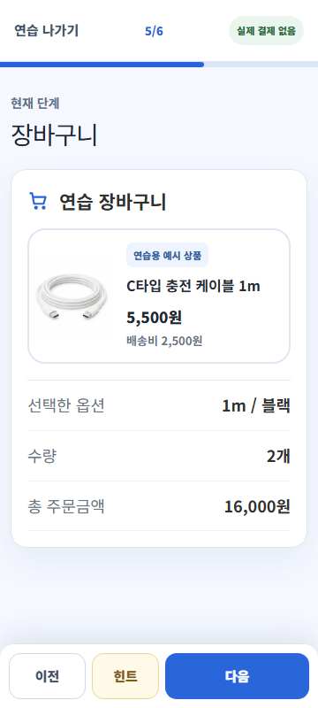

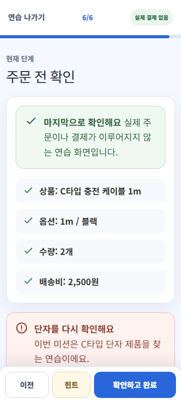

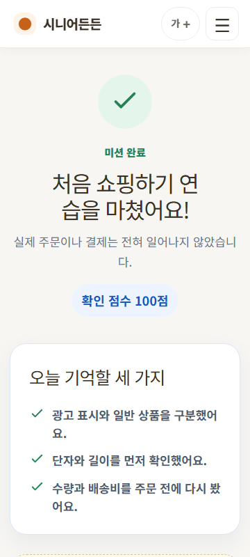

### 장마·비교·실수 찾기

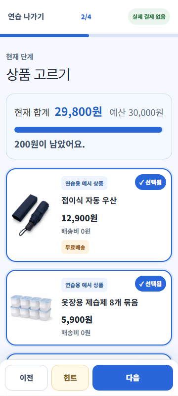

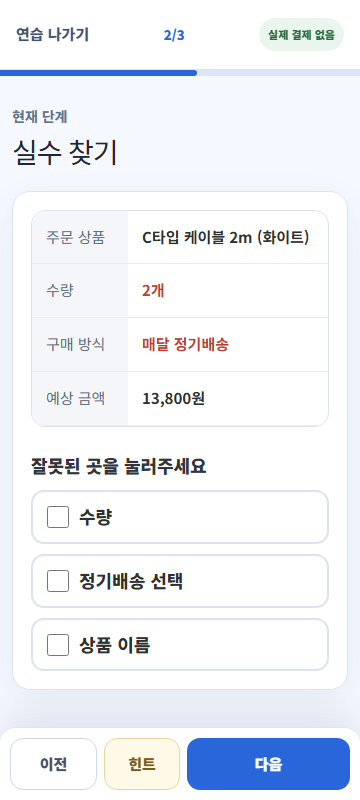

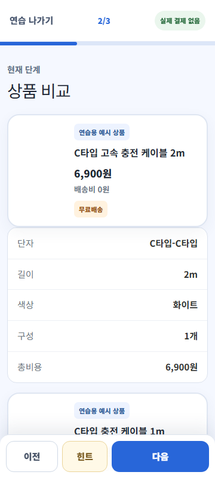

### 실제 상품과 큰 글씨

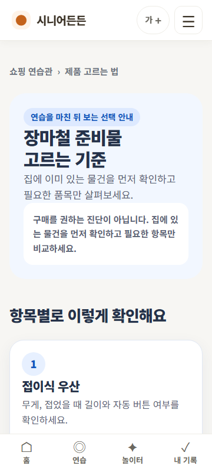

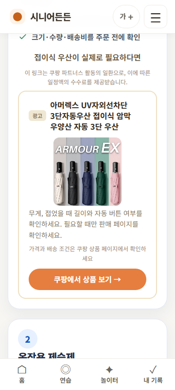

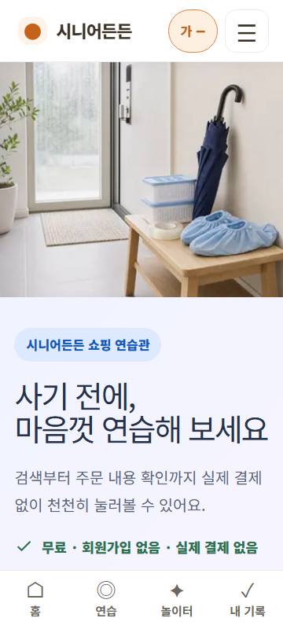

## 7. 브라우저 콘솔 오류

production의 허브, 처음 쇼핑, 장마, 실수 찾기, 비교, 제휴 collection, 큰 글씨 흐름을 별도 Chromium 컨텍스트에서 실행하며 `console.error`와 `pageerror`를 수집했다.

```json
{
  "consoleErrors": [],
  "pageErrors": []
}
```

서비스워커 이전 버전을 가진 브라우저에서는 “새로운 내용이 준비됐어요 / 새로고침” 배너가 하단 CTA 위에 나타났다. 새로고침 후 사라졌으며 콘솔 오류는 아니지만 360px 첫 진입 CTA를 일부 가릴 수 있는 운영 UX 문제다.

## 8. 실패한 테스트와 자동화 공백

### 이번 수동 production 감사에서 실패

| ID | 테스트 | 실제 결과 |
|---|---|---|
| AUDIT-F01 | 장바구니 단계에서 새로고침 후 이어하기 | 5/6 → 1/6 초기화, 선택 상태 소실 |
| AUDIT-F02 | 장마 미션 배송비 포함 예산 초과 | 최대 29,800원, 초과 상태 도달 불가 |
| AUDIT-F03 | 예산 초과 후 상품 제거·재판정 | 선행 초과 상태가 없어 실행 불가 |
| AUDIT-F04 | 옵션·배송비 실수 찾기 | 클릭 가능한 위험 지점 자체가 없음 |
| AUDIT-F05 | 장마 결과의 사용액·남은 예산 표시 | 결과 화면에 표시되지 않음 |
| AUDIT-F06 | 장바구니 안에서 품목 삭제·수량 변경 | 컨트롤이 없음 |

### 현재 저장소 자동 테스트 결과

- 전체 Playwright: **32 passed, 0 failed**
- 쇼핑 테스트: **3개**
- 쇼핑 테스트가 다루는 범위: 허브 overflow, 처음 쇼핑 happy path, 장마 필수 3종 happy path
- 따라서 자동 테스트 0 실패는 완성도를 뜻하지 않는다. 위 AUDIT-F01~F06은 현재 테스트 파일에 존재하지 않는다.

## 9. 현재 production 라우트 목록

아래 16개 구체 URL은 모두 HTTP 200을 확인했다.

```text
/shopping
/shopping/missions/first-usb-c-cable
/shopping/missions/first-usb-c-cable/practice
/shopping/missions/first-usb-c-cable/result
/shopping/missions/rainy-budget-30000
/shopping/missions/rainy-budget-30000/practice
/shopping/missions/rainy-budget-30000/result
/shopping/missions/compare-usb-c-cables
/shopping/missions/compare-usb-c-cables/practice
/shopping/missions/compare-usb-c-cables/result
/shopping/missions/find-order-mistake
/shopping/missions/find-order-mistake/practice
/shopping/missions/find-order-mistake/result
/shopping/products/charging
/shopping/products/rainy-season
/shopping/products/safe-shopping
```

## 10. 현재 미션 JSON 상당 목록

실제 저장 형식은 별도 JSON 파일이 아니라 `content/shopping.ts` 안의 TypeScript 배열을 Zod로 parse하는 방식이다.

```json
[
  {
    "slug": "first-usb-c-cable",
    "mode": "guided",
    "title": "C타입 충전 케이블 사기",
    "productIds": ["cable-usbc-white-2m", "cable-usbc-black-1m", "cable-eightpin-white-2m"],
    "steps": ["상품 검색", "검색 결과", "상세 정보", "옵션 선택", "장바구니", "주문 전 확인"],
    "correctProductId": "cable-usbc-white-2m"
  },
  {
    "slug": "rainy-budget-30000",
    "mode": "budget",
    "title": "3만 원으로 장마철 준비하기",
    "budget": 30000,
    "productIds": ["rain-umbrella-navy", "rain-dehumidifier-eight", "rain-anti-slip-tape", "rain-shoe-covers"],
    "requiredCategoryIds": ["umbrella", "dehumidifier", "anti-slip"]
  },
  {
    "slug": "compare-usb-c-cables",
    "mode": "compare",
    "title": "조건에 맞는 충전 케이블 비교하기",
    "productIds": ["cable-usbc-white-2m", "cable-usbc-black-1m", "cable-usbc-white-3pack"],
    "correctProductId": "cable-usbc-white-2m"
  },
  {
    "slug": "find-order-mistake",
    "mode": "mistake",
    "title": "주문 화면의 실수 찾기",
    "productIds": ["cable-usbc-white-2m"],
    "requiredMistakeIds": ["quantity", "subscription"]
  }
]
```

## 11. 현재 상품 JSON 상당 목록

```json
[
  {"id":"cable-usbc-white-2m","categoryId":"charging-cable","title":"C타입 고속 충전 케이블 2m","examplePrice":6900,"shippingFee":0,"bundleQuantity":1,"image":"usb-c-cable-white-2m.jpg"},
  {"id":"cable-usbc-black-1m","categoryId":"charging-cable","title":"C타입 충전 케이블 1m","examplePrice":5500,"shippingFee":2500,"bundleQuantity":1,"image":"usb-c-cable-white-2m.jpg"},
  {"id":"cable-eightpin-white-2m","categoryId":"charging-cable","title":"8핀 충전 케이블 2m","examplePrice":5900,"shippingFee":0,"bundleQuantity":1,"image":"usb-c-cable-white-2m.jpg"},
  {"id":"cable-usbc-white-3pack","categoryId":"charging-cable","title":"C타입 충전 케이블 3개 묶음","examplePrice":10900,"shippingFee":0,"bundleQuantity":3,"image":"usb-c-cable-white-2m.jpg"},
  {"id":"rain-umbrella-navy","categoryId":"umbrella","title":"접이식 자동 우산","examplePrice":12900,"shippingFee":0,"bundleQuantity":1,"image":"compact-umbrella-navy.jpg"},
  {"id":"rain-dehumidifier-eight","categoryId":"dehumidifier","title":"옷장용 제습제 8개 묶음","examplePrice":5900,"shippingFee":0,"bundleQuantity":8,"image":"dehumidifier-box-eight-pack.jpg"},
  {"id":"rain-anti-slip-tape","categoryId":"anti-slip","title":"투명 미끄럼방지 테이프","examplePrice":4500,"shippingFee":0,"bundleQuantity":1,"image":"anti-slip-tape-clear.jpg"},
  {"id":"rain-shoe-covers","categoryId":"shoe-cover","title":"방수 신발 덮개","examplePrice":6500,"shippingFee":0,"bundleQuantity":1,"image":"waterproof-shoe-covers-blue.jpg"}
]
```

관찰상 장마 네 상품 합계는 `12,900 + 5,900 + 4,500 + 6,500 = 29,800원`이다. 유료배송 장마 상품이 없어 설계서의 핵심 배송비 학습 조건을 만들 수 없다.

## 12. 이미지 자산 감사

| 배포 자산 | 규격 | 용량 | 판정 |
|---|---:|---:|---|
| `shopping-practice-hero.jpg` | 1200×900 | 143,538B | 생성 자산, 장마 대표와 같은 이미지 |
| `rainy-season-budget.jpg` | 1200×900 | 143,538B | 생성 자산 |
| `usb-c-cable-white-2m.jpg` | 800×800 | 35,916B | 생성 자산, 케이블 4종이 공용 |
| `compact-umbrella-navy.jpg` | 800×800 | 41,896B | 생성 자산 |
| `dehumidifier-box-eight-pack.jpg` | 800×800 | 43,997B | 생성 자산 |
| `anti-slip-tape-clear.jpg` | 800×800 | 42,986B | 생성 자산 |
| `waterproof-shoe-covers-blue.jpg` | 800×800 | 43,418B | 생성 자산 |

원본 PNG 6개와 프롬프트 기록이 있어 임시 회색 placeholder는 아니다. 그러나 설계서 V1 인벤토리의 상태 이미지 4종, 디지털 6종, 장마 8종을 충족하지 않으며 `docs/shopping-asset-plan.md`는 개별 자산 검수 상태나 인간 승인 없이 네 행을 모두 “완료”로 표시한다. AGENTS의 용량·alt·연습/제휴 분리 규칙은 대체로 지켰지만 설계서의 WebP 기본 형식과 전체 인벤토리는 지키지 않았다.

## 13. 실행 계획

아래 계획은 이번 감사에서 확인한 격차만 보완한다. 새 주제나 임의 디자인 개편은 포함하지 않는다.

### P0: 사용자가 쇼핑 연습관에 접근하고 한 미션을 완전히 끝낼 수 있게 하는 작업

1. 쇼핑을 `PRACTICES`의 정식 장소 카드로 등록하고 메인·연습 목록·모바일 메뉴의 진입 계약을 테스트한다.
2. 처음 쇼핑 검색 단계에서 검색어/추천어 조건을 실제 검증하고 검색을 건너뛰지 못하게 한다.
3. 주문 전 확인에 상품가·배송비·수량·총액과 확인 동작을 표시한다.
4. active mission 전체 상태를 저장하고 새로고침 시 “이어하기/처음부터”를 선택하게 한다.
5. 잘못된 상품 피드백을 실패 규칙에 맞게 수정한다.
6. P0 production E2E: 접근→오답→수정→완료→새로고침 기록→진행 중 이어하기.

### P1: 장바구니·옵션·배송비·예산·판정 엔진

1. `ProductOptionGroup`, `CartItem`, `ValidationRule`, `ScoringRule` 스키마를 설계서 수준으로 구현한다.
2. 선택 상품을 실제 cart action으로 담고 카트에서 수량·옵션 수정과 삭제가 가능하게 한다.
3. 공통 selector에서 `상품합계`, `옵션 추가금`, `배송비`, `총액`, `남은 예산`을 한 번만 계산한다.
4. 배송비가 주문당 한 번인지 수량당인지 명시한 고정 정책을 구현한다.
5. evaluator를 rule interpreter로 바꾸고 피드백·점수를 rule ID에 연결한다.
6. localStorage version migration, 손상 복구, 기록 초기화와 active state를 테스트한다.

### P2: 장마철·비교·실수 찾기 미션 완성

1. 장마 상품 풀에 유료배송 대체상품을 넣어 예산 초과가 반드시 도달 가능하게 한다.
2. 초과→카트 제거→예산 이하, 필수 카테고리 각각 누락, 정확히 30,000원을 E2E로 검증한다.
3. 비교 미션을 exact product ID가 아니라 단자·길이·수량·총비용 규칙으로 판정한다.
4. 실수 찾기에 옵션·배송비 위험 지점을 추가하고 정기배송·수량과 함께 개별 설명한다.
5. 설계 범위에 맞춰 배송조회·취소 미션을 추가하되 교환·반품은 계획된 버전 순서를 지킨다.
6. 장마 결과에 사용액·남은 예산·선택 이유를, 실수 결과에 발견 항목을 표시한다.

### P3: 실물 이미지와 쿠팡파트너스 연결

1. 자산 계획을 설계서 V1 인벤토리 단위로 다시 작성하고 `planned/generated/needs-review/approved` 상태를 기록한다.
2. 검은 1m C타입, 흰 8핀, 3개 묶음, 유료배송 예시 등 실제로 구분되는 자산을 제작한다.
3. 상태 이미지와 장마 대체상품 이미지를 만들고 WebP로 최적화한다.
4. production 검색 API 의존을 제거할지 제품 결정을 확정한다. 설계서 기준을 따르면 사용자가 제공·승인한 정적 공식 링크 레지스트리로 전환한다.
5. 외부 URL allowlist, https 검증, enabled flag, `noreferrer`, “새 창” 문구/아이콘을 추가한다.
6. 제휴 실제 상품 이미지와 연습용 생성 이미지를 시각·대체텍스트·고지로 계속 분리한다.

### P4: 모바일·접근성·회귀 테스트

1. 360×800, 390×844, 768×1024, 1440×900 스크린샷 기준선을 만든다.
2. 큰 글씨 상태에서 허브·검색·옵션·카트·결과·제휴 화면을 모두 검사한다.
3. 키보드만으로 네 미션을 완료하고 포커스 표시·순서·고정 하단 조작부를 검사한다.
4. axe 치명적 오류 0을 품질 게이트로 추가한다.
5. evaluator/storage/cart 단위 테스트와 컴포넌트 테스트를 추가한다.
6. 기존 7종 키오스크 32개 회귀 테스트를 CI 필수로 유지하고 쇼핑의 실패 경로 테스트를 별도로 추가한다.

## 14. 최종 판정

현재 상태는 “V1 완성”이 아니라 **V1의 네 미션을 클릭 가능한 형태로 연결한 초기 구현**이다. P0의 새로고침 이어하기와 완전한 첫 미션 계약, P1의 실제 장바구니/규칙 엔진, P2의 도달 가능한 예산 초과가 먼저 해결되어야 제품 설계서의 핵심 학습 경험을 충족한다.
